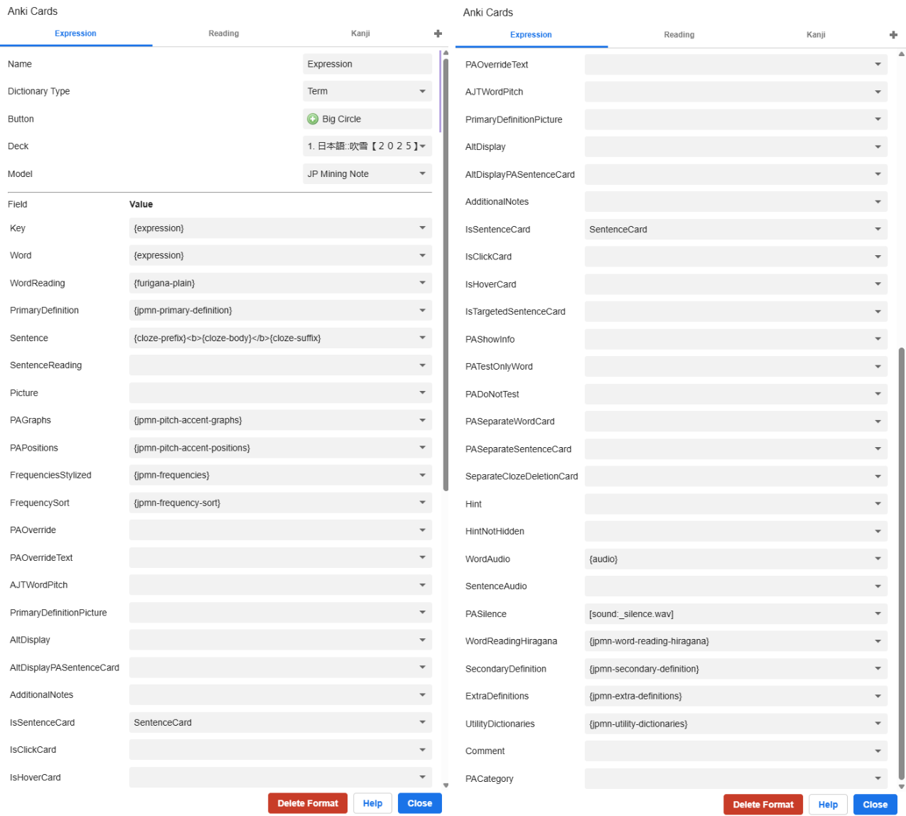

# Introduction

yomitan is what makes learning japanese enjoyable, use it.

## Installation

go to [main page](https://github.com/yomidevs/yomitan) and installation in README, install for your browser, I suggest chromium it is less problematic for extensions.

I like to have a separate browser for japanese learning.

## Dictionaries
Go to [themoeway page](https://learnjapanese.moe/yomichan/) and find Shoui's Yomitan Dictionary Collection there. Peak dictionaries that you like, read through recommendations.

The ones I use:
1. Bilingual/JMdict (Recommended)
2. Bilingual/大辞典
3. Frequency/JPDB (Recommended)
4. Frequency/CC100
5. Kanji/KANJIDIC (English) (Recommended)
6. Monolingual/明鏡国語辞典 第三版
7. Monolingual/三省堂国語辞典　第八版 (Recommended)
8. Monolingual/新明解国語辞典 第八版 (Recommended)
9. Monolingual/Pixiv
10. Monolingual/旺文社国語辞典 第十一版 (Recommended) - disabled
11. Grammar/Bunpro
12. Grammar/Dictionary of Japanese Grammar 日本語文法辞典 (Recommended)
13. Grammar/JLPT文法解説まとめ (nihongo_kyoushi)
14. Grammar/どんなとき使う日本語表現文型辞典
15. Grammar/毎日のんびり日本語教師 (nihongosensei)
16. Grammar/絵でわかる日本語
17. Names/JMnedict
18. Pitch Accent/アクセント辞典v2 (Recommended)
19. Bilingual/Wadoku 和独辞典 (JA-DE)
20. Bilingual/研究社露和辞典 (яп-ру)
21. Others/\[Etymology\] 複合語起源

## Settings
Make sure that advanced settings are turned on (bottom left corner).

Go to tab Dictionaries and click on configure installed and enabled dictionaries.
Import all selected dictionaries.

Go to tab Anki and enable anki integration. Then configure Anki flashcard, here is the [guide](https://arbyste.github.io/jp-mining-note/setupyomichan/#yomichan-fields)

make sure to install jp mining note template [here](https://arbyste.github.io/jp-mining-note/setupyomichan/#yomichan-templates)

## Proper fonts
fix chinese + yomitan nice font

## Next

As the next setup, you can go to [Mining section](/jpguides/mining/) to learn how to harvest cards from different media.